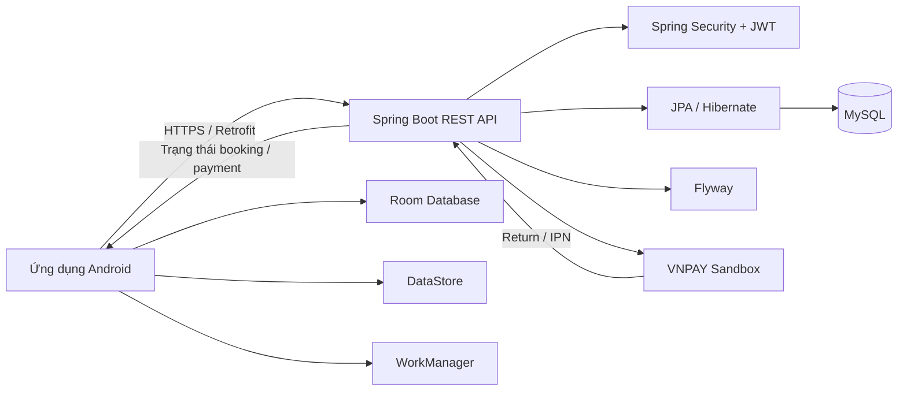

# BookingHotel

[](https://github.com/truongnguyen3006/BookingHotel/actions/workflows/android-ci.yml)
[](https://github.com/truongnguyen3006/BookingHotel/actions/workflows/backend-ci-cd.yml)

Ứng dụng đặt phòng khách sạn full-stack gồm **Android native** và **Spring Boot backend**, được xây dựng theo hướng production-ready cho mục đích portfolio.

Dự án tập trung vào các bài toán thực tế như xác thực JWT, đặt phòng và quản lý tồn kho, thanh toán VNPAY, chống race condition, đồng bộ dữ liệu offline-first và triển khai backend thực tế.

## Tải APK

**[Tải BookingHotel phiên bản mới nhất](https://github.com/truongnguyen3006/BookingHotel/releases/latest)**

> Ứng dụng sử dụng **VNPAY Sandbox** để demo thanh toán. Không có giao dịch tiền thật.

## Tính năng chính

- Đăng ký, đăng nhập và đăng xuất
- JWT access token và rotating refresh token
- Tự động refresh token khi nhiều request gặp `401`
- Xem danh sách phòng, tìm kiếm, lọc và sắp xếp
- Xem chi tiết phòng
- Chọn ngày nhận/trả phòng, số khách và số lượng phòng
- Tạo booking và giữ tồn kho
- Xem lịch sử booking
- Theo dõi trạng thái thanh toán
- Thanh toán bằng VNPAY Sandbox
- Deep link quay lại ứng dụng sau thanh toán
- Tự động hoàn trả tồn kho khi thanh toán thất bại hoặc booking hết hạn
- Offline-first cache bằng Room
- Đồng bộ nền bằng WorkManager
- Cô lập dữ liệu theo session người dùng
- Admin quản lý phòng, booking và payment

## Công nghệ sử dụng

### Android

- Kotlin
- Jetpack Compose
- Material 3
- ViewModel + StateFlow
- Hilt
- Retrofit + OkHttp
- Room
- DataStore
- WorkManager

### Backend

- Java 17
- Spring Boot
- Spring Security
- JWT
- Spring Data JPA / Hibernate
- MySQL
- Flyway
- Testcontainers

## Kiến trúc hệ thống



## Điểm kỹ thuật nổi bật

- Dùng pessimistic locking cho các luồng booking/payment cần đảm bảo đồng thời
- Payment sử dụng idempotency key
- Chỉ cho phép một payment `PENDING` hoạt động trên mỗi booking
- Inventory được hoàn trả đúng một lần khi booking thất bại hoặc hết hạn
- VNPAY IPN được xử lý trong transaction và có bảo vệ callback đến trễ
- Giá booking được lưu dưới dạng snapshot VND bằng kiểu số nguyên
- Token refresh dùng cơ chế single-flight để tránh race condition
- Cache booking được cô lập theo session để tránh rò dữ liệu giữa các tài khoản

## Cấu trúc project

```text
BookingHotel/
├── .github/       # GitHub Actions
├── app/           # Android app
├── backend/       # Spring Boot backend
├── gradle/
├── build.gradle.kts
├── settings.gradle.kts
└── README.md
```

## Chạy project ở local

### Backend

```powershell
cd backend
docker compose up -d
.\gradlew.bat bootRun
```

### Android

Mở project bằng Android Studio, chọn build variant `debug` và chạy trên emulator hoặc thiết bị thật.

Android Emulator mặc định kết nối backend local qua:

```text
http://10.0.2.2:8080/
```

## Kiểm thử

### Android

```powershell
.\gradlew.bat testDebugUnitTest
.\gradlew.bat lintDebug
.\gradlew.bat assembleDebug
.\gradlew.bat connectedDebugAndroidTest
```

### Backend

```powershell
cd backend
.\gradlew.bat test
.\gradlew.bat integrationTest
.\gradlew.bat build
```

## Triển khai

- Backend và MySQL được triển khai trên Railway
- Android release tắt CARD/QR demo và sử dụng backend production
- CI/CD được thực hiện bằng GitHub Actions
- APK release đã được kiểm thử trên thiết bị Android thật, bao gồm luồng VNPAY Sandbox

---

Dự án được xây dựng như một portfolio **Android + Java Backend**, tập trung vào tính đúng đắn của transaction, xử lý đồng thời, bảo mật phiên đăng nhập và vòng đời thanh toán.
