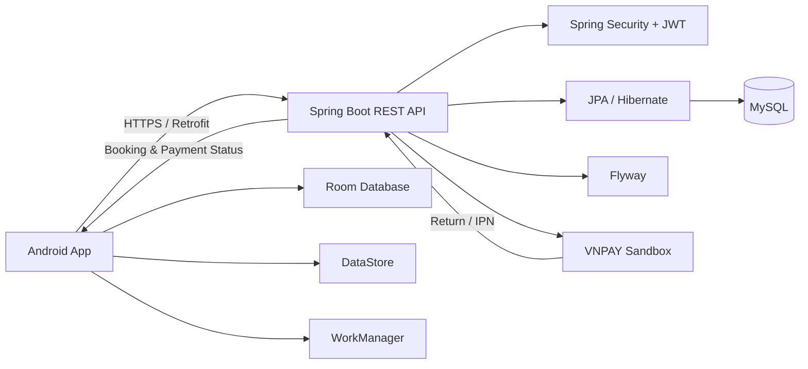

# BookingHotel

[](https://github.com/truongnguyen3006/BookingHotel/actions/workflows/android-ci.yml)
[](https://github.com/truongnguyen3006/BookingHotel/actions/workflows/backend-ci-cd.yml)

Ứng dụng đặt phòng khách sạn full-stack được xây dựng theo hướng production-ready, gồm ứng dụng Android native và backend Spring Boot.

Dự án tập trung vào các vấn đề thực tế như xác thực JWT, đặt phòng và quản lý tồn kho, xử lý thanh toán, chống race condition, đồng bộ dữ liệu offline-first, migration cơ sở dữ liệu và quy trình build/release.

## Tải ứng dụng

APK Android đã ký được phát hành tại GitHub Releases:

**[Tải phiên bản BookingHotel mới nhất](https://github.com/truongnguyen3006/BookingHotel/releases/latest)**

> VNPAY hiện chạy ở **Sandbox** để phục vụ mục đích demo và kiểm thử. Không có giao dịch tiền thật.

## Tính năng chính

- Đăng ký, đăng nhập và đăng xuất tài khoản
- JWT access token và rotating refresh token
- Tự động refresh token theo cơ chế single-flight khi nhiều request gặp `401`
- Xem danh sách phòng, tìm kiếm, lọc và sắp xếp
- Xem chi tiết phòng
- Chọn ngày nhận/trả phòng, số khách và số lượng phòng
- Tạo booking và giữ tồn kho
- Xem lịch sử booking
- Theo dõi trạng thái booking và payment
- Tích hợp VNPAY Sandbox
- Deep link khi quay lại ứng dụng sau thanh toán
- Idempotency cho payment
- Ngăn nhiều payment `PENDING` hoạt động đồng thời trên cùng booking
- Tự động hoàn trả tồn kho khi payment thất bại hoặc booking hết hạn
- Scheduler xử lý booking bỏ dở
- Room Database theo hướng offline-first
- WorkManager đồng bộ dữ liệu nền
- Cô lập cache theo session để tránh dữ liệu User A rò sang User B
- Admin dashboard quản lý phòng, booking và payment
- Flyway migration cho MySQL
- CI cho Android và backend
- Backend production triển khai trên Railway

## Kiến trúc hệ thống



### Android

- Kotlin
- Jetpack Compose
- Material 3
- Navigation Compose
- ViewModel + StateFlow
- Hilt
- Retrofit + OkHttp
- Room
- DataStore
- WorkManager

### Backend

- Java 17
- Spring Boot
- Spring Security
- JWT Authentication
- Spring Data JPA / Hibernate
- MySQL
- Flyway
- Testcontainers

## An toàn Booking và Payment

Luồng booking/payment được thiết kế để đảm bảo tính nhất quán dữ liệu khi có retry hoặc request chạy đồng thời.

- Tồn kho phòng được reserve trong transaction.
- Các thao tác booking/payment quan trọng sử dụng pessimistic locking.
- Booking thất bại hoặc hết hạn chỉ hoàn trả tồn kho đúng một lần.
- Payment sử dụng idempotency key.
- Mỗi booking chỉ được có một payment `PENDING` đang hoạt động.
- VNPAY IPN khóa booking trước, sau đó mới khóa payment để giữ lock ordering nhất quán.
- Callback đến trễ không thể làm sống lại booking đã bị release tồn kho.
- Giá booking được lưu dưới dạng snapshot VND bằng kiểu số nguyên, tránh sai số floating-point.

## Xác thực và cô lập Session

Hệ thống sử dụng JWT access token ngắn hạn kết hợp rotating refresh token.

Android client serialize các request refresh token chạy đồng thời, tránh trường hợp nhiều request `401` cùng lúc tạo ra race condition hoặc logout sai.

Dữ liệu booking cache được gắn với session hiện tại. Nếu User A logout rồi User B login, các response cũ của User A sẽ không được phép ghi vào cache của User B.

## VNPAY Sandbox

VNPAY được tích hợp như payment provider bên ngoài cho mục đích demo.

Luồng tổng quát:

```text
Tạo booking
    ↓
Tạo payment VNPAY
    ↓
Mở VNPAY Sandbox
    ↓
VNPAY Return / IPN
    ↓
Backend xác thực kết quả
    ↓
SUCCESS / FAILED
    ↓
Android cập nhật booking và tồn kho
```

Android client không coi dữ liệu trả về từ browser là nguồn sự thật cuối cùng. Trạng thái payment cuối cùng luôn được xác nhận lại với backend.

## Cấu trúc project

```text
BookingHotel/
├── .github/
│   └── workflows/          # CI Android, backend và release
├── app/                    # Ứng dụng Android native
├── backend/                # Spring Boot REST API
├── gradle/                 # Gradle wrapper
├── android-env.example.properties
├── keystore.properties.example
├── build.gradle.kts
├── gradle.properties
├── gradlew
├── gradlew.bat
└── settings.gradle.kts
```

## Chạy project ở local

### Yêu cầu

- JDK 17
- Android Studio
- Android SDK 35
- Docker Desktop hoặc MySQL local

### 1. Chạy backend

Từ thư mục root của project:

```powershell
cd backend
docker compose up -d
.\gradlew.bat bootRun
```

Android Emulator mặc định gọi backend local qua:

```text
http://10.0.2.2:8080/
```

### 2. Chạy Android app

Mở repository bằng Android Studio:

1. Chọn build variant `debug`
2. Chọn emulator hoặc thiết bị thật
3. Bấm Run

Build `debug` cho phép test CARD/QR demo ở môi trường local.

Build `release` sẽ tắt simulated payment và sử dụng backend production.

## Build và Test

### Android

```powershell
.\gradlew.bat testDebugUnitTest
.\gradlew.bat lintDebug
.\gradlew.bat assembleDebug
.\gradlew.bat assembleDebugAndroidTest
```

Nếu có emulator hoặc thiết bị thật:

```powershell
.\gradlew.bat connectedDebugAndroidTest
```

### Backend

```powershell
cd backend
.\gradlew.bat test
.\gradlew.bat integrationTest
.\gradlew.bat build
```

Integration test sử dụng MySQL/Testcontainers để kiểm tra các luồng booking, payment, security, concurrency và Flyway migration.

## Build Release

Release build yêu cầu HTTPS production backend hợp lệ và release signing credentials.

Ví dụ cấu hình local:

```properties
BOOKING_API_PROD_URL=https://your-production-api.example.com/
```

Signing có thể cấu hình bằng `keystore.properties` hoặc environment variables.

Keystore thật và mật khẩu không được commit lên GitHub.

Build `release`:

- tắt CARD/QR demo
- bật code shrinking
- bật resource shrinking
- yêu cầu production backend dùng HTTPS
- hỗ trợ signed APK/AAB

## Database Migration

Flyway quản lý schema MySQL.

Phiên bản hiện tại có migration từ **V1 đến V6**, bao gồm:

- schema khởi tạo
- authentication và booking ownership
- dữ liệu VNPAY provider
- booking reservation lifecycle
- chuyển toàn bộ money sang VND `BIGINT`
- unique constraint cho active payment

Không chỉnh sửa migration đã được áp dụng trên database production. Nếu cần thay đổi schema, hãy tạo migration mới.

## CI/CD

GitHub Actions được dùng để kiểm tra Android và backend.

- **Android CI**: unit test, lint, build và instrumentation test trên emulator
- **Backend CI/CD**: unit test, MySQL integration test và build validation
- **Android Release**: hỗ trợ build signed APK/AAB khi tạo release tag và repository đã cấu hình signing secrets

## Trạng thái Release

**v1.0.0** là stable release đầu tiên của project.

Kết quả final audit:

- Critical: 0
- High: 0
- Production blockers: 0

Signed Release APK đã được kiểm thử trực tiếp trên thiết bị Android thật, bao gồm cả luồng VNPAY Sandbox end-to-end.

## Post-v1.0 Backlog

Một số cải tiến UX nhỏ được giữ lại cho các phiên bản sau:

- Khôi phục URL VNPAY khi app bị process death trong lúc payment đang `PROCESSING`
- Hủy authenticated periodic WorkManager ngay khi logout

Hai mục trên không ảnh hưởng đến tính đúng đắn của booking/payment, security hoặc tính toàn vẹn dữ liệu của v1.0.0.

---

Dự án được xây dựng như một portfolio full-stack Android + Java Backend, tập trung vào transactional correctness, concurrency safety, authentication, payment lifecycle và release engineering.
