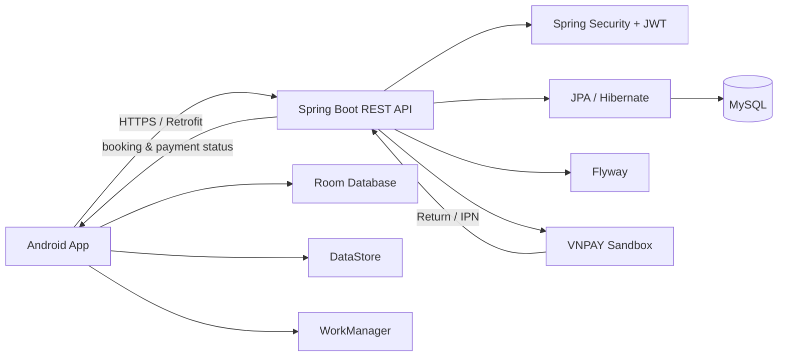

# BookingHotel

[](https://github.com/truongnguyen3006/BookingHotel/actions/workflows/android-ci.yml)
[](https://github.com/truongnguyen3006/BookingHotel/actions/workflows/backend-ci-cd.yml)

A full-stack hotel booking application built as a production-oriented Android portfolio project.

The project combines a native Android client with a Spring Boot REST API, MySQL persistence, JWT authentication, offline-first caching, inventory reservation, concurrency protection, and VNPAY Sandbox payment integration.

## Download

The signed Android APK is published through GitHub Releases:

**[Download the latest BookingHotel release](https://github.com/truongnguyen3006/BookingHotel/releases/latest)**

> VNPAY runs in **Sandbox mode** for demonstration. No real payment is processed.

## Highlights

- User registration, login and logout
- JWT access tokens with rotating refresh tokens
- Automatic single-flight token refresh for concurrent requests
- Hotel room browsing, search, filters and sorting
- Room details, check-in/check-out dates, guests and quantity validation
- Booking creation with inventory reservation
- Booking history and payment lifecycle tracking
- VNPAY Sandbox payment flow with return/deep-link handling
- Payment idempotency and duplicate-active-payment protection
- Inventory restoration after failed or expired payments
- Scheduled expiration of abandoned reservations
- Offline-first Room cache and WorkManager synchronization
- Per-session cache isolation across logout/user switching
- Admin dashboard for rooms, bookings and payments
- Flyway database migrations
- Android and backend CI pipelines
- Production backend deployed on Railway

## Architecture



### Android

- Kotlin
- Jetpack Compose + Material 3
- Navigation Compose
- ViewModel + StateFlow
- Hilt
- Retrofit + OkHttp
- Room
- DataStore
- WorkManager

### Backend

- Java 17
- Spring Boot
- Spring Security
- JWT authentication
- Spring Data JPA / Hibernate
- MySQL
- Flyway
- Testcontainers

## Booking and Payment Safety

The booking lifecycle is designed to protect inventory and payment consistency under retries and concurrent requests.

- Room inventory is reserved transactionally.
- Booking and payment operations use pessimistic locking where required.
- Failed or expired bookings restore inventory exactly once.
- Payment attempts use idempotency keys.
- Only one active `PENDING` payment is allowed for a booking.
- VNPAY IPN processing locks the booking before the payment to keep lock ordering consistent.
- Late provider callbacks cannot resurrect a booking whose inventory has already been released.
- Booking prices are stored as native VND snapshots using integer values rather than floating-point money.

## Authentication and Session Isolation

Authentication uses short-lived JWT access tokens and rotating refresh tokens.

The Android client serializes concurrent token refreshes so multiple simultaneous `401` responses do not trigger competing refresh requests. Private cached booking data is associated with the active app session, preventing stale responses from a previous user from being written after logout or account switching.

## VNPAY Sandbox

VNPAY is integrated as an external payment provider for demonstration purposes.

Typical flow:

```text
Create booking
    ↓
Create VNPAY payment
    ↓
Open VNPAY Sandbox
    ↓
VNPAY Return / IPN
    ↓
Backend verifies provider result
    ↓
SUCCESS / FAILED
    ↓
Android refreshes booking and inventory state
```

The Android client does not trust browser return parameters as the source of truth. Final payment status is resolved against the backend.

## Project Structure

```text
BookingHotel/
├── .github/
│   └── workflows/          # Android, backend and release CI
├── app/                    # Native Android application
├── backend/                # Spring Boot REST API
├── gradle/                 # Gradle wrapper files
├── android-env.example.properties
├── keystore.properties.example
├── build.gradle.kts
├── gradle.properties
├── gradlew
├── gradlew.bat
└── settings.gradle.kts
```

## Local Development

### Requirements

- JDK 17
- Android Studio
- Android SDK 35
- Docker Desktop or a local MySQL instance
- Node.js is **not** required

### 1. Start the backend

From the repository root:

```powershell
cd backend
docker compose up -d
.\gradlew.bat bootRun
```

The local Android emulator uses:

```text
http://10.0.2.2:8080/
```

### 2. Run the Android app

Open the repository in Android Studio, select the `debug` build variant, choose an emulator/device, and run the app.

The debug build enables local demo CARD/QR payments. Production release builds disable simulated payments.

## Build and Test

### Android

```powershell
.\gradlew.bat testDebugUnitTest
.\gradlew.bat lintDebug
.\gradlew.bat assembleDebug
.\gradlew.bat assembleDebugAndroidTest
```

With an emulator/device:

```powershell
.\gradlew.bat connectedDebugAndroidTest
```

### Backend

```powershell
cd backend
.\gradlew.bat test
.\gradlew.bat integrationTest
.\gradlew.bat build
```

The integration suite uses MySQL/Testcontainers to exercise payment, booking, security, concurrency and Flyway migration behavior.

## Release Build

Release builds require a real HTTPS production backend URL and signing credentials.

Example local Gradle property:

```properties
BOOKING_API_PROD_URL=https://your-production-api.example.com/
```

Signing values can be supplied through `keystore.properties` or environment variables. Real keystores and passwords are intentionally excluded from Git.

The `release` build:

- disables demo CARD/QR payments
- enables code/resource shrinking
- requires a valid HTTPS production backend
- supports signed APK/AAB generation

## Database Migrations

Flyway manages the MySQL schema. The current release contains migrations through **V6**, covering authentication/booking ownership, VNPAY provider data, reservation lifecycle, native VND money storage and exclusive active payments.

Do not edit migrations that have already been applied to a deployed database; add a new migration instead.

## CI/CD

GitHub Actions validates the Android and backend codebases.

- **Android CI** — unit tests, lint, build and emulator instrumentation tests
- **Backend CI/CD** — unit tests, MySQL integration tests and build validation
- **Android Release** — supports signed APK/AAB builds for release tags when repository signing secrets are configured

## Release Status

**v1.0.0** is the first stable portfolio release.

The final audit reported:

- Critical: 0
- High: 0
- Production blockers: 0

The release APK has also been manually tested on a physical Android device, including the VNPAY Sandbox end-to-end flow.

---

Built as a full-stack Android + Java backend portfolio project with an emphasis on transactional correctness, concurrency safety, authentication, payment lifecycle handling and deployable release engineering.
